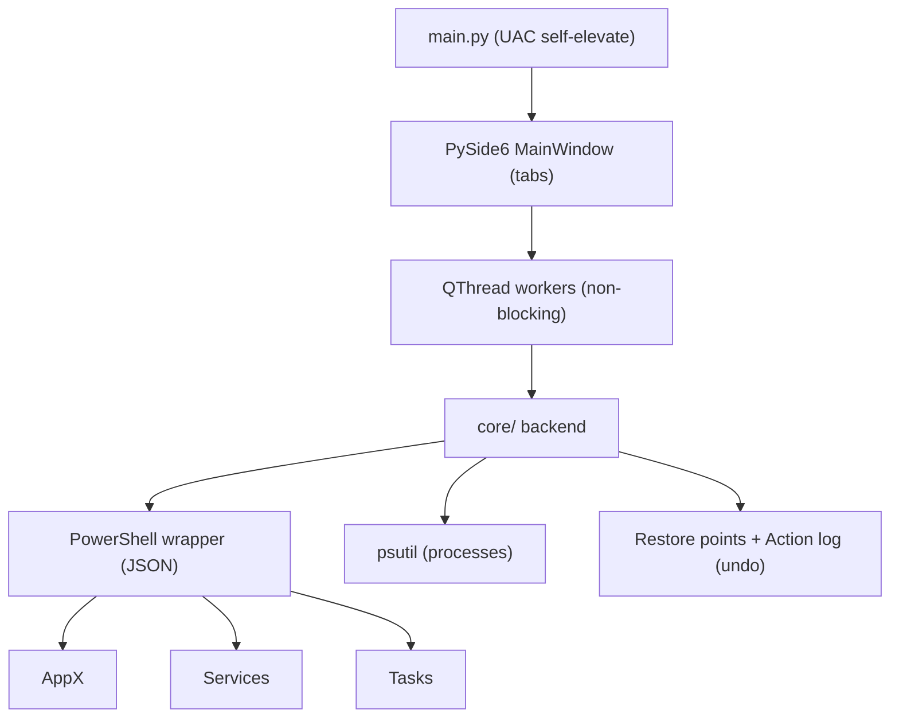

# Windows Debloater & Task Control Tool

## Goal
A self-elevating (UAC) PySide6 desktop app, packaged into a single `.exe` via PyInstaller, that lets the user:
- Remove Windows bloatware (AppX/provisioned packages) by checkbox selection.
- View and control background **services**, **scheduled tasks**, and **running processes**.
- Detect **suspicious tasks** via heuristics and act on them (suspend/kill/disable).
- Stay safe: **Safe mode** (curated, reversible) by default with an **Advanced** toggle, system **restore points**, confirmations, and an **undo/action log**.

## Decisions (confirmed)
- GUI: **PySide6**
- Scope: **Both** - Safe default + Advanced toggle
- Location: `~/win-debloater`
- Python 3.13.7; PowerShell + `psutil` for backend.

## Architecture

## File structure
- `win-debloater/`
  - `PLAN.md`, `README.md`, `requirements.txt`, `app.spec`, `run.py`
  - `app/main.py` - entry, UAC elevation, launch UI
  - `app/core/elevation.py` - admin check + `ShellExecuteW runas`
  - `app/core/powershell.py` - safe PS exec, JSON parse, timeouts
  - `app/core/appx.py` - list/remove/restore AppX & provisioned packages
  - `app/core/services.py` - list/start/stop/set-starttype services
  - `app/core/scheduled_tasks.py` - list/enable/disable tasks
  - `app/core/processes.py` - list/suspend/resume/kill (psutil)
  - `app/core/suspicious.py` - scoring heuristics
  - `app/core/restore.py` - `Checkpoint-Computer` restore points
  - `app/core/actionlog.py` - JSON action history + undo
  - `app/core/data/bloatware.json` - curated safe-removal catalog
  - `app/ui/main_window.py`, `bloatware_tab.py`, `services_tab.py`, `tasks_tab.py`, `processes_tab.py`, `widgets.py`, `workers.py`
  - `app/resources/style.qss`

## Key technical approach
- **AppX removal**: `Get-AppxPackage`/`Get-AppxProvisionedPackage` (`ConvertTo-Json`), remove via `Remove-AppxPackage` and `Remove-AppxProvisionedPackage`. Reversible by re-registering / reinstalling; full names logged for undo.
- **Services**: `Get-CimInstance Win32_Service` for StartMode; control via `Stop-Service`/`Set-Service -StartupType`. Original StartType saved before change.
- **Scheduled tasks**: `Get-ScheduledTask` -> `Disable-ScheduledTask`/`Enable-ScheduledTask`.
- **Processes/suspicious**: `psutil` live list; heuristic score from exe path in temp/appdata/downloads, missing/unsigned signature, no publisher/description, autostart cross-reference, suspicious name patterns. Actions: suspend/resume/kill.
- **Safety**: Safe mode exposes curated, reversible items only; Advanced toggle unlocks broader control behind confirmation. Optional restore point before destructive batches. Every destructive action recorded for undo.
- **Threading**: backend calls run in `QThread` workers so UI never freezes.
- **Packaging**: PyInstaller one-file build via `app.spec` with `uac_admin=True` manifest.

## Phased execution
1. Scaffold & elevation.
2. PowerShell core + AppX.
3. Services, tasks, processes, suspicious.
4. Safety layer (restore points, action log).
5. GUI build.
6. Wire UI <-> core.
7. Package to .exe.
8. Docs & smoke test.

## Risks / notes
- Destructive OS operations require Administrator; the `.exe` triggers a UAC prompt. Full validation needs an elevated session (ideally a test VM).
- Removing some provisioned packages affects all users; Safe mode avoids critical components.
