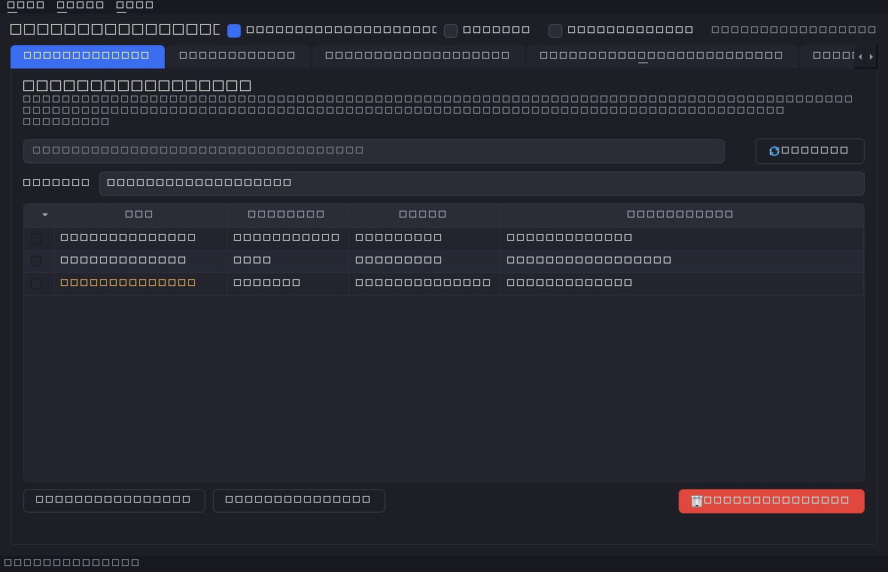
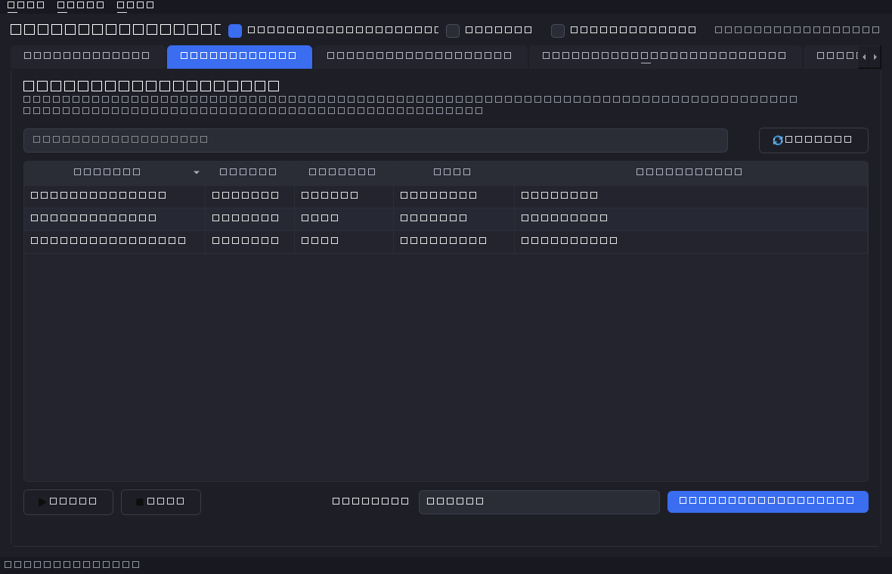
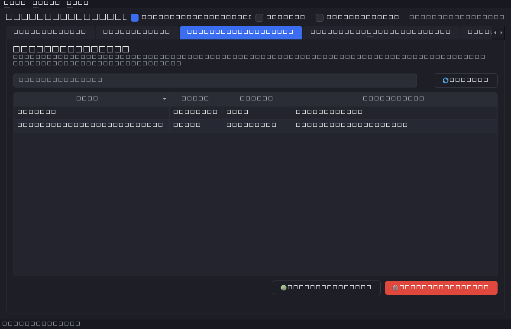
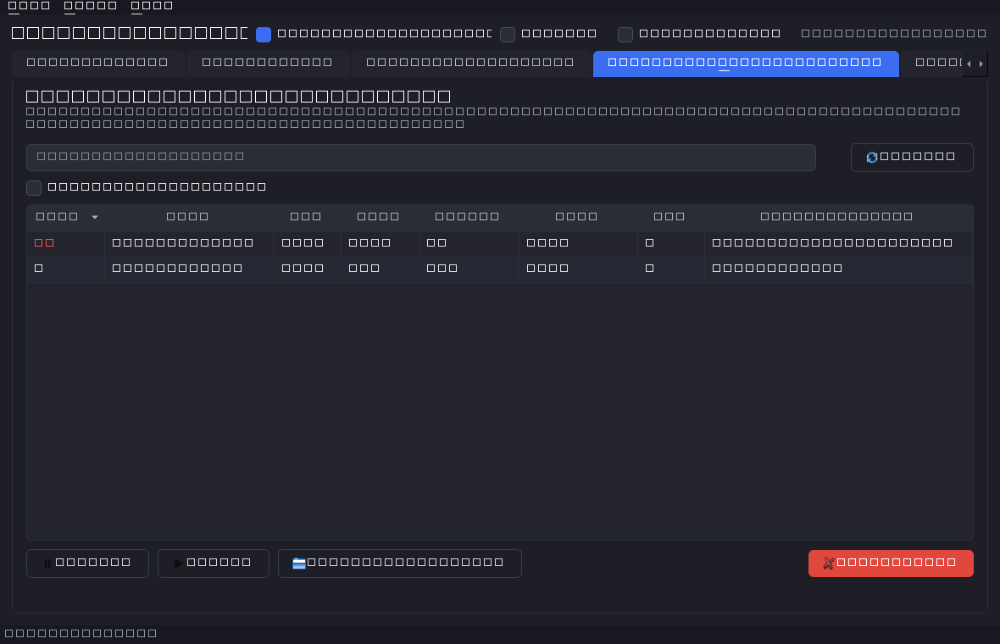
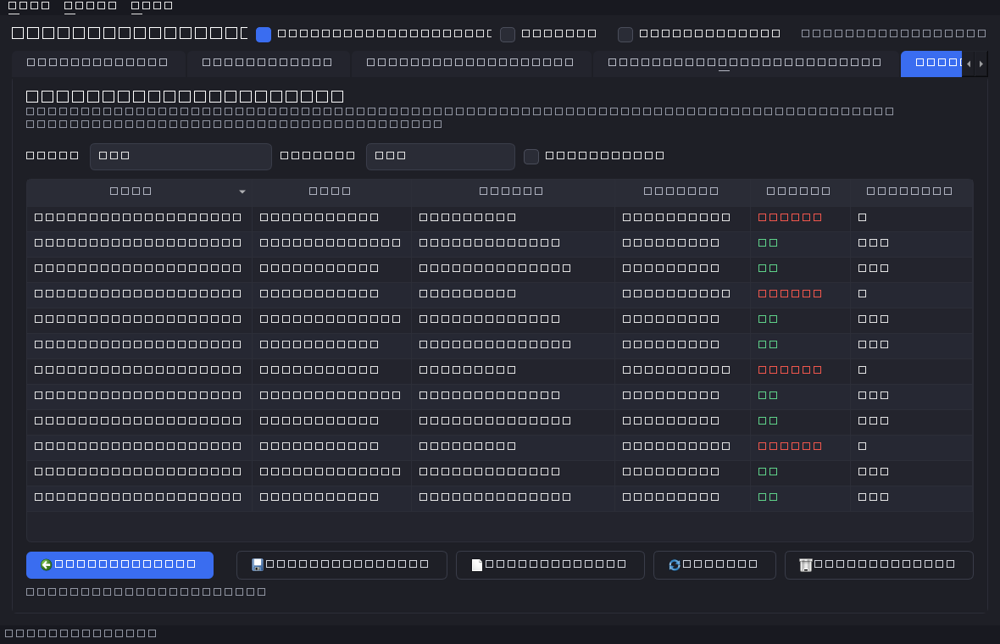

# Windows Debloater & Task Control

A modern PySide6 desktop tool (packaged as a single `.exe`) to remove Windows
bloatware, control background services and scheduled tasks, and detect/act on
suspicious processes — with safety guardrails, restore points, dry-run, and undo.




## Contents

- [Features](#features)
- [Screenshots](#screenshots)
- [Safety & threat model](#safety--threat-model)
- [How it compares](#how-it-compares)
- [Requirements](#requirements)
- [Run from source](#run-from-source)
- [Build the .exe](#build-the-exe)
- [Development](#development)
- [Project layout](#project-layout)
- [FAQ & troubleshooting](#faq--troubleshooting)
- [License](#license)

## Features

- **Bloatware removal** — uninstall Windows Store (AppX) apps by checkbox.
  NonRemovable packages can be force-removed (registry unlock, admin). Curated
  **presets** ("All Xbox", "Privacy starter", …) select common bundles in one click.
  Microsoft Edge (Chromium) is uninstalled through its own `setup.exe`
  (`Remove-AppxPackage` cannot remove it), so ticking Edge actually removes it.
- **Installed Programs removal** — a dedicated tab for classic desktop / **MSI**
  programs that don't appear as Store apps (e.g. the **Windows SDK** and its
  ~40 MSI components, runtimes, and vendor tools). Reads the standard Uninstall
  registry hives and runs each entry's uninstaller silently (`msiexec /x … /qn`
  for MSI). Safe mode hides Windows updates and hidden system components. A
  **group picker** selects whole suites in one click (e.g. "Windows SDK (all
  components)", "Visual C++ Redistributables", ".NET runtimes & SDKs").
- **Services control** — stop/start services and change startup type
  (Automatic / Manual / Disabled). Critical system services are protected.
- **Scheduled tasks** — enable/disable tasks (telemetry/diagnostic tasks are
  surfaced in Safe mode). Fully reversible.
- **Processes & suspicious detection** — live process list scored by heuristics
  (unusual paths, unsigned binaries, system-binary impersonation, random names,
  network activity). Suspend, resume, end, or locate. CPU% is sampled correctly
  on first scan.
- **Safe vs Advanced modes** — Safe mode shows only known, low-risk, reversible
  items; Advanced mode unlocks everything (with extra confirmations).
- **Dry-run mode** — preview every change without touching the system; actions
  are logged as `(dry-run)` and are non-undoable.
- **Safety net** — optional **System Restore point** before destructive batches,
  confirmation dialogs, and a full **action history with one-click undo**.
- **Profiles** — export the current service/task/app state to JSON and re-apply
  it on another machine (dry-run aware, changes only what differs).
- **Snapshots & diff** — save a state snapshot and later see exactly *what
  changed since* (services, tasks, AppX added/removed).
- **Diagnostics & support bundle** — view OS/Defender/disk/restore status, and
  one-click zip up logs + diagnostics + recent history for bug reports.
- **Productivity** — light/dark theme toggle, per-column show/hide, sortable
  tables, live tab counts, cancellable batches, and keyboard shortcuts.
- **User catalog overlay** — add your own OEM/vendor apps via
  `%LOCALAPPDATA%\WinDebloater\bloatware.user.json` without editing the build.
- **Update check** — optional non-blocking check against GitHub Releases.

### Keyboard shortcuts

| Shortcut | Action |
|----------|--------|
| `Ctrl+F` | Focus the search box of the current tab |
| `F5`     | Refresh the current tab |
| `Delete` | Primary destructive action (remove / disable / end) — when a table is focused |
| `Ctrl+A` | Select all shown (Bloatware tab) |
| `Ctrl+Z` | Undo selected (History tab) |

## Screenshots

| | |
|---|---|
|  |  |
|  |  |

> Screenshots are generated by `python tools/screenshots.py` (run on a real
> display for proper fonts).

## Safety & threat model

- **Safe mode (default):** only curated, well-known, reinstallable apps;
  common privacy/performance services; and known telemetry tasks are shown.
- **Advanced mode:** shows all packages/services/tasks. Hard-coded protected
  lists still prevent touching OS-critical services and processes.
- **What it will not do:** it never touches a protected service/process even in
  Advanced mode, and it requires explicit confirmation for destructive batches.
- **Auditability:** every action is written to a JSON history at
  `%LOCALAPPDATA%\WinDebloater\action_history.json`, and every PowerShell call is
  recorded in a rotating log at `%LOCALAPPDATA%\WinDebloater\app.log`.
- **Reversibility:** AppX removals, service start-type/state changes, task
  toggles, and process suspends are undoable from the History tab.
- **PowerShell safety:** all interpolated names are single-quote escaped
  (`ps_quote`) to avoid script injection from odd package/service names.

## How it compares

| | This tool | O&O ShutUp10++ | Windows10Debloater (WPD-style) |
|---|---|---|---|
| AppX removal (incl. provisioned) | ✅ | ❌ | ✅ |
| Services & scheduled tasks | ✅ | partial | partial |
| Suspicious-process triage | ✅ | ❌ | ❌ |
| Dry-run preview | ✅ | ❌ | ❌ |
| One-click undo / history | ✅ | partial | ❌ |
| Restore point before changes | ✅ | ✅ | partial |
| Open source, scriptable core | ✅ | ❌ | ✅ |

(Comparison is approximate and based on typical feature sets; verify against the
latest versions of each tool.)

## Requirements

- Windows 10/11
- Administrator rights for changes (the app self-elevates via UAC)
- For running from source: Python 3.10+ (developed on 3.13)

## Run from source

```powershell
python -m venv .venv
.\.venv\Scripts\python.exe -m pip install -r requirements.txt
.\.venv\Scripts\python.exe run.py
```

Use `run.py --no-elevate` during development to skip the UAC prompt
(listing works; system changes may fail without elevation).

## Build the .exe

```powershell
.\.venv\Scripts\python.exe -m PyInstaller app.spec --noconfirm --clean
```

The single-file executable is produced at `dist\WinDebloater.exe`. It carries an
embedded `requireAdministrator` manifest, so double-clicking it triggers a UAC
prompt automatically. The build keeps `console=True` so logs are visible while
debugging.

### Troubleshooting the build

- **`WARNING: Execution of 'set_exe_build_timestamp' failed on attempt #1 / 20: PermissionError(13, 'Permission denied')`** — PyInstaller could not update the timestamp of `dist\WinDebloater.exe` because *something else has a handle open on that file*. The retry loop usually succeeds within a few attempts, but if it doesn't, the culprit is almost always one of:
  1. **A previous `WinDebloater.exe` is still running** (very common — check Task Manager for `WinDebloater.exe`, kill it, then rebuild).
  2. **Windows Defender real-time protection** is scanning the freshly-written exe. Either wait a few seconds and rebuild, or add `V:\temp\win-debloater\dist\` to the Defender exclusion list for development.
  3. **Explorer / an antivirus** is generating a thumbnail or hash. Close any Explorer window showing `dist\`.
  4. **A file lock from the previous build** was not released. Try `rmdir /s /q build dist` and rebuild.
- **Build succeeds despite the warning?** You can ignore it — PyInstaller only warns; the timestamp gets set on a later retry. The final `WinDebloater.exe` is functionally identical.

## Development

```powershell
# install dev tooling (pytest, ruff, mypy, coverage)
.\.venv\Scripts\python.exe -m pip install -r requirements-dev.txt

# run the test suite (Qt offscreen so it's headless)
$env:QT_QPA_PLATFORM = "offscreen"
.\.venv\Scripts\python.exe -m pytest

# lint, format check, and type-check
.\.venv\Scripts\python.exe -m ruff check .
.\.venv\Scripts\python.exe -m ruff format --check .
.\.venv\Scripts\python.exe -m mypy app/core

# optional: pre-commit hooks
pre-commit install
```

CI (GitHub Actions) runs lint + type-check, the test matrix (Windows + Linux)
with coverage, a headless GUI smoke test, and — on a `v*` tag — builds the
Windows executable and publishes a GitHub Release. No repository secrets are
required.

## Project layout

```
app/
  main.py              entry + UAC self-elevation + logging setup
  core/
    elevation.py       admin detection / relaunch
    powershell.py      safe PowerShell exec (cancellable) + JSON parsing
    appx.py            list/remove/restore Store apps (+ TTL cache, overlay)
    programs.py        list/uninstall Win32/MSI programs (Add-or-Remove Programs)
    services.py        list/control services
    scheduled_tasks.py list/enable/disable tasks
    processes.py       psutil process control + CPU sampling
    suspicious.py      suspicion scoring heuristics
    restore.py         system restore points
    actionlog.py       history + undo dispatcher
    applog.py          rotating app.log
    dryrun.py          process-wide dry-run toggle
    presets.py         curated selection presets
    profile.py         export/apply/diff system state
    diagnostics.py     OS/Defender/disk/restore facts
    support.py         support-bundle zip
    updates.py         GitHub release update check (stdlib)
    data/bloatware.json, data/presets.json
  ui/
    main_window.py     tabs, menus, theme, shortcuts, badges
    models.py          QAbstractTableModel + filter/sort proxy
    theme.py           light/dark stylesheet builder
    *_tab.py           per-feature tabs (QTableView based)
    workers.py         QThread workers (with cancel)
    widgets.py         shared widgets + std_icon
  resources/style.qss  reference dark stylesheet
tools/
  screenshots.py       doc screenshot generator
  winget/              winget manifest template
```

## FAQ & troubleshooting

**A change "succeeded" but nothing happened.**
Some operations need a real elevated session and/or a reboot. Start the app via
the UAC prompt (not `--no-elevate`) and re-check.

**An app I removed came back.**
Windows can re-provision some packages via Windows Update. Removing the
provisioned copy (done automatically) reduces this, but Edge and a few system
apps may still return.

**Where is the Windows SDK / a normal desktop program?**
Those are not Store (AppX) apps, so they live in the **Installed Programs** tab,
not the Bloatware tab. MSI products (like the Windows SDK) are uninstalled
silently; some third-party programs without a silent uninstaller may briefly
show their own uninstall window.

**Microsoft Edge wouldn't uninstall before.**
Edge is uninstalled via its bundled `setup.exe --uninstall --force-uninstall`
(the app also sets the `AllowUninstall` policy). Requires Administrator, and
Windows Update may reinstall it later.

**Restore didn't reinstall an app.**
"Restore" re-registers an app from an on-disk manifest; if none remains,
reinstall from the Microsoft Store.

**Where are the logs?**
`%LOCALAPPDATA%\WinDebloater\app.log` (rotating). Use **History → Open log file**
or **Help → Collect support bundle** to zip everything up.

**How do I add my own apps to the catalog?**
Use **Tools → Edit catalog overlay**, add entries, then **Refresh** the
Bloatware tab.

**Are the suspicion scores a verdict?**
No — they are heuristic signals (unsigned, odd path, random name, etc.). Review
before acting.

## License

Proprietary — for personal, non-commercial use only. See [LICENSE](LICENSE).
Review actions carefully; use at your own risk.
